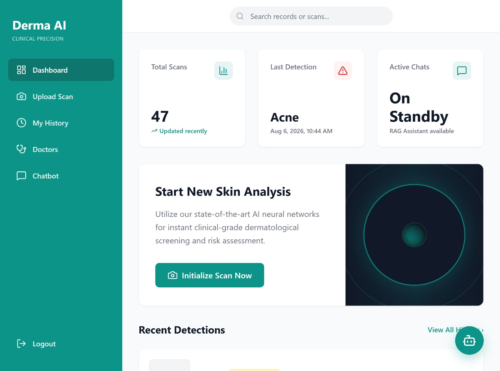
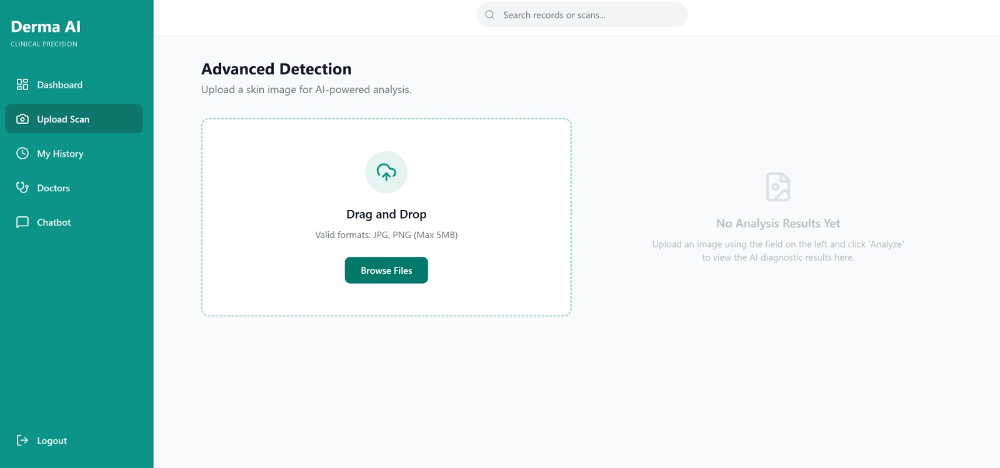
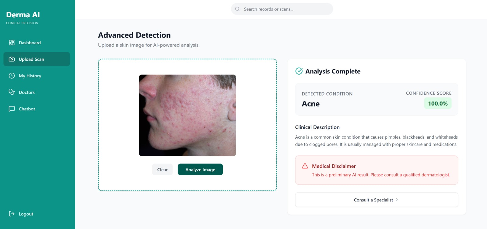
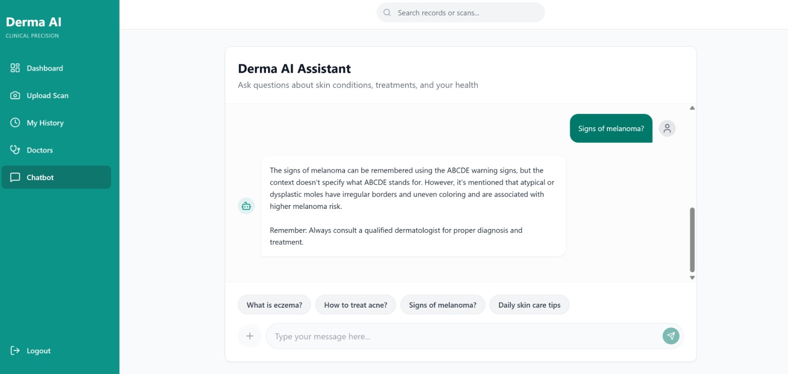
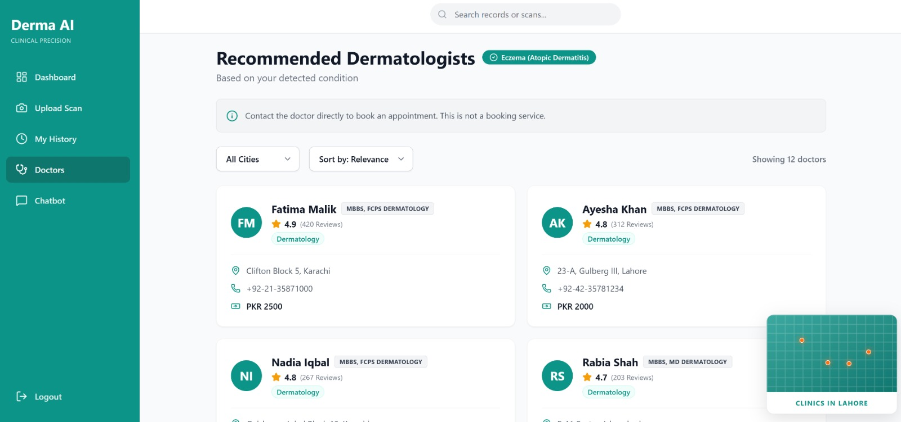
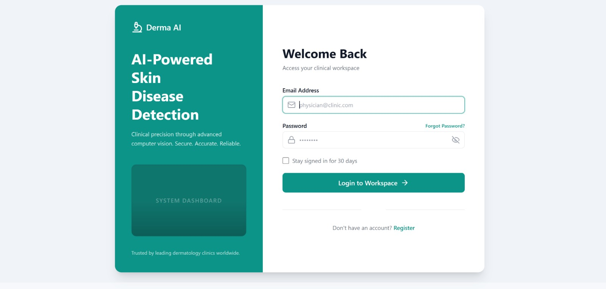

# DermaAI

DermaAI is a full-stack AI-powered web application for skin disease detection and medical Q&A. It has a React frontend, a Django backend, a TensorFlow image classification model, and a RAG chatbot built on a FAISS knowledge base.

## What You Need

- Node.js 20 or newer
- Python 3.10 or newer
- PostgreSQL server
- Git

## Project Structure

```text
DermaAI/
├── backend/                Django backend
├── src/                    React frontend
├── public/                 Frontend static files
├── requirements.txt       Full Python dependency list
├── package.json            Frontend dependency list
└── dermaai_model.keras     Skin disease model file
```

## Important Files

- [requirements.txt](requirements.txt) contains the Python packages needed for the backend.
- [package.json](package.json) contains the frontend packages and scripts.
- [dermaai_model.keras](dermaai_model.keras) is the trained image classification model.
- [backend/knowledge_base/faiss_index](backend/knowledge_base/faiss_index) contains the FAISS index used by the chatbot.

## Environment Variables

Create a `.env` file in the project root with values like these:

```env
SECRET_KEY=your_secret_key_here
DEBUG=True
DB_NAME=derma_db
DB_USER=derma_user
DB_PASSWORD=your_secure_password_here
DB_HOST=db
DB_PORT=5432
REDIS_URL=redis://redis:6379/0
GROQ_API_KEY=your_groq_api_key_here
```

## Run Without Docker

Use this setup if you want to run the frontend and backend directly on your machine.

### 1. Install prerequisites

Install the following tools first:

- Python 3.10 or newer
- Node.js 20 or newer
- PostgreSQL
- Git

Redis is optional for basic local development, but PostgreSQL is required because the backend uses it as the database.

### 2. Create the project environment file

Create a `.env` file in the project root with values like these:

```env
SECRET_KEY=your_secret_key_here
DEBUG=True
DB_NAME=derma_db
DB_USER=derma_user
DB_PASSWORD=your_secure_password_here
DB_HOST=127.0.0.1
DB_PORT=5432
REDIS_URL=redis://127.0.0.1:6379/0
GROQ_API_KEY=your_groq_api_key_here
```

### 3. Place the required runtime files

For full functionality, make sure these files exist in the project root:

- `dermaai_model.keras`
- `backend/knowledge_base/faiss_index/`

### 4. Set up PostgreSQL

Create a PostgreSQL database and user that match the values in your `.env` file. For example:

- Database: `derma_db`
- User: `derma_user`
- Password: `your_secure_password_here`

If you use different names, update the `.env` file to match.

### 5. Set up the backend

Open a terminal in the project root and move into the backend folder:

```bash
cd backend
```

Create a virtual environment:

```bash
python -m venv .venv
```

Activate it on Windows:

```bash
.venv\Scripts\activate
```

Install the backend dependencies from the root requirements file:

```bash
pip install -r ..\requirements.txt
```

Run database migrations:

```bash
python manage.py migrate
```

Create an admin user if needed:

```bash
python manage.py createsuperuser
```

Start the backend server:

```bash
python manage.py runserver 0.0.0.0:8000
```

The backend will be available at `http://localhost:8000`.

### 6. Set up the frontend

Open a second terminal in the project root and install the frontend packages:

```bash
npm install
```

Start the frontend development server:

```bash
npm run dev
```

The frontend will be available at `http://localhost:5173`.

### 7. Open the application

- Frontend: `http://localhost:5173`
- Backend API: `http://localhost:8000`
- Django Admin: `http://localhost:8000/admin`

## Screenshots

<table>
  <tr>
    <td align="center" width="33%">
      <br/>
      <sub><b>Dashboard</b></sub>
    </td>
    <td align="center" width="33%">
      <br/>
      <sub><b>Upload Scan</b></sub>
    </td>
    <td align="center" width="33%">
      <br/>
      <sub><b>Analysis Result</b></sub>
    </td>
  </tr>
  <tr>
    <td align="center" width="33%">
      <br/>
      <sub><b>RAG Chatbot</b></sub>
    </td>
    <td align="center" width="33%">
      <br/>
      <sub><b>Recommended Doctors</b></sub>
    </td>
    <td align="center" width="33%">
      <br/>
      <sub><b>Login</b></sub>
    </td>
  </tr>
</table>

## How the AI Parts Work

- The image detection feature uses `dermaai_model.keras`.
- The chatbot uses the FAISS index inside `backend/knowledge_base/faiss_index`.
- If the model or FAISS index is missing, the project still starts, but those features will fall back or be limited.

## Notes for Submission

- Do not submit `node_modules`, `.venv`, or other cache folders.
- Keep the source code, dependency files, and configuration templates in the submission package.
- Include runtime assets such as the model file and FAISS index only if you want the project to run immediately without rebuilding them.

## Features

- Skin disease image detection
- Doctor recommendation system
- RAG chatbot for skin health questions
- JWT authentication
- Detection history tracking

## License

This project is for academic use.
